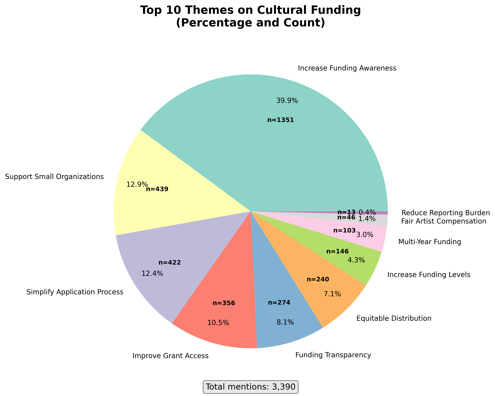

# WHAT: Cultural Funding Thematic Analysis

**Generated:** June 21, 2025

## Top 10 Themes on Cultural Funding

### 1. Increase Funding Awareness
- **Frequency:** 1351 mentions (39.9%)
- **Supporting Evidence:**
  1. Cost of tickets or admission fees ;Location- Lack of nearby venues or events in my neighborhood ;Transportation / parking issues ;Limited diversity/ representation/ inclusion in events ;Lack of awaren
  2. Cost of tickets or admission fees ;Transportation / parking issues ;Lack of awareness about events and programs ;Limited diversity/ representation/ inclusion in events ;
  3. Transportation / parking issues ;Lack of awareness about events and programs ;Limited diversity/ representation/ inclusion in events ;Cost of tickets or admission fees ;Location- Lack of nearby venues

### 2. Support Small Organizations
- **Frequency:** 439 mentions (12.9%)
- **Supporting Evidence:**
  1. Lack of funding for artists and creatives ;Limited opportunities for emerging artists ;Impact of gentrification on creative communities ;
  2. Lack of funding for artists and creatives ;Rising costs of venues and performance spaces ;Limited opportunities for emerging artists ;
  3. Lack of funding for artists and creatives ;Accessibility of arts and cultural events to all residents ;Limited opportunities for emerging artists ;

### 3. Simplify Application Process
- **Frequency:** 422 mentions (12.4%)
- **Supporting Evidence:**
  1. Need for expanded cultural programming ;The biggest challenge is the matrix of city funding applications and how pretentious terminology is used for DEI. ;
  2. Lack of funding for artists and creatives ;Need for expanded cultural programming ;City arts funding program applications hostile to applicants legacy artist and arts organizations;
  3. Lack of funding for artists and creatives ;Wildly shifting priorities in the funding process;

### 4. Improve Grant Access
- **Frequency:** 356 mentions (10.5%)
- **Supporting Evidence:**
  1. With the changes to federal grant requirements and clawback of existing federal grants I think ACME should reconsider the limits against getting funding on consecutive years
  2. - Consult organizational and cultural leaders before making decisions about artist resources, venues, funding, etc by implementing surveys and/or creating long term work groups
- Inform the public in 
  3. Austin’s creative community is full of organizations doing important work, but a lot of them are under-supported or overlooked. ACME can better support these groups by making sure they are actually be

### 5. Funding Transparency
- **Frequency:** 274 mentions (8.1%)
- **Supporting Evidence:**
  1. Impact of gentrification on creative communities ;Lack of funding for artists and creatives ;Affordable housing availability has one of the greatest impacts on the capacity for people to make a living
  2. Rising costs of venues and performance spaces ;Impact of gentrification on creative communities ;City's lack of understanding what public arts funding is for - it's not an income program for "creative
  3. Consistent communication, consistent funding, comprehensive understanding of issues and commitment to prioritizing and solving without politicizing. 

### 6. Equitable Distribution
- **Frequency:** 240 mentions (7.1%)
- **Supporting Evidence:**
  1. Lack of funding for artists and creatives ;Rising costs of venues and performance spaces ;Music gets all the attention while theatre is drowning (outside of the major equity houses);
  2. Lack of funding for artists and creatives ;Need for expanded cultural programming ;Equal access to funding for all artists. Artists should not be excluded because of the length of time they have dedic
  3. Meet with cultural leaders regularly, document reported needs, and take actions to create equitable programs that support small and medium-sized organizations that serve historically marginalized comm

### 7. Increase Funding Levels
- **Frequency:** 146 mentions (4.3%)
- **Supporting Evidence:**
  1. More funding opportuntieis; listening to artists and gathering the orgs input into the strategic planning work
  2. Additional Funding. Especially for businesses that coordinate, handle logistics, provide support staff; and that also build staging, backdrops and props; and that do marketing, design, and other docum
  3. Connect them to additional funding sources to help amplify their success. 

### 8. Multi-Year Funding
- **Frequency:** 103 mentions (3.0%)
- **Supporting Evidence:**
  1. Cost of tickets or admission fees ;Transportation / parking issues ;lack of long-term funding and staff support to put on events;
  2. Lack of funding for artists and creatives ;Rising costs of venues and performance spaces ;sustainable income for artists/musician;
  3. Lack of funding for artists and creatives ;Rising costs of venues and performance spaces ;Lack of sustainable arts opportunities and business models;

### 9. Fair Artist Compensation
- **Frequency:** 46 mentions (1.4%)
- **Supporting Evidence:**
  1. Lack of funding for artists and creatives ;Rising costs of venues and performance spaces ;Difficulty of small venues to pay artist living wages;
  2. - Consult organizational and cultural leaders before making decisions about artist resources, venues, funding, etc by implementing surveys and/or creating long term work groups
- Inform the public in 
  3. Money.  For Operation costs and artist pay. 
Don't tie money to specific events or cultural exploitation or for non-profit entities only.  
Theaters and Venues and Artists need money to pay rent, pay 

### 10. Reduce Reporting Burden
- **Frequency:** 13 mentions (0.4%)
- **Supporting Evidence:**
  1. Grants and workshops that support organization and individual artists': needs, grantwriting, copyright, forming of, and reporting for nonprofits. How to apply for grants. Marketing, Connections to ven
  2. Based on the current budgetary policies of CAD grants like Elevate, organizations are actually discouraged to collaborate and share resources (financial capital, host collaborative events, etc.) in or
  3. Provide more unrestricted funding and guidance for grant reporting
