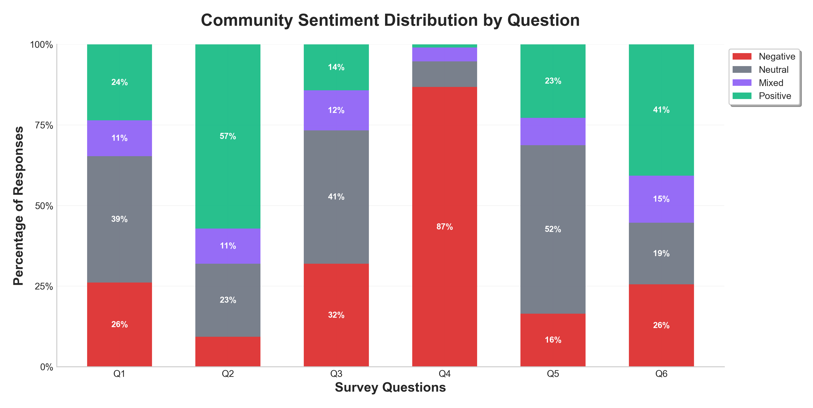
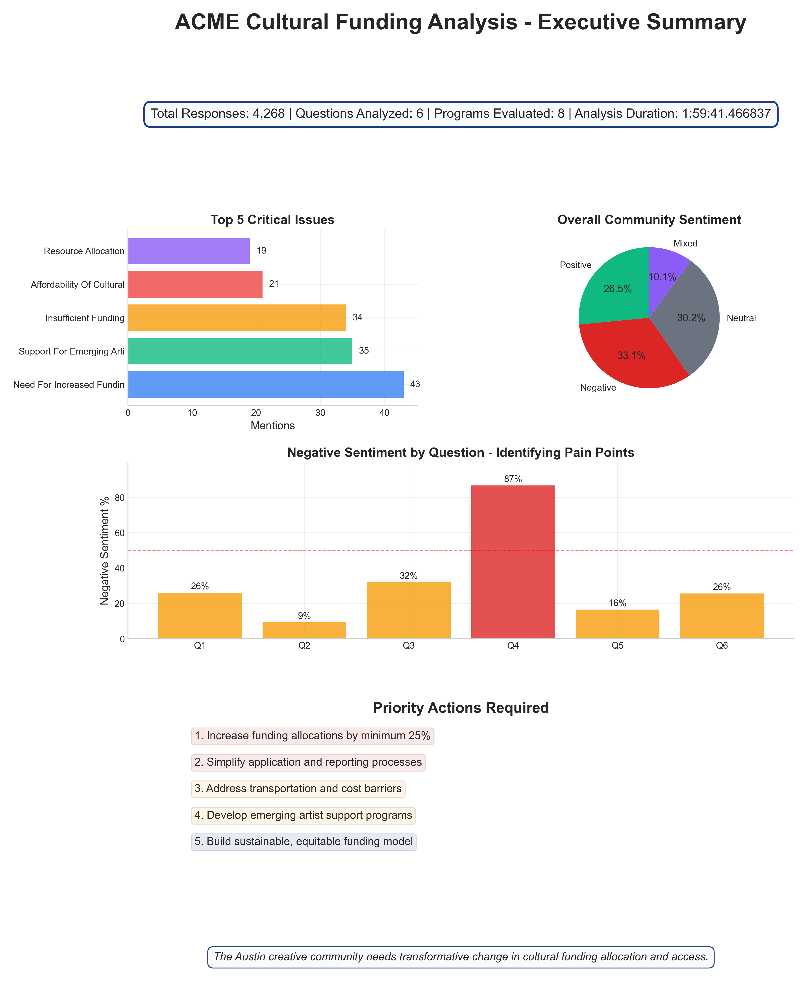
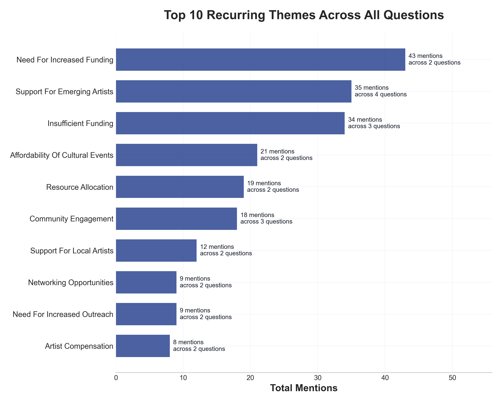
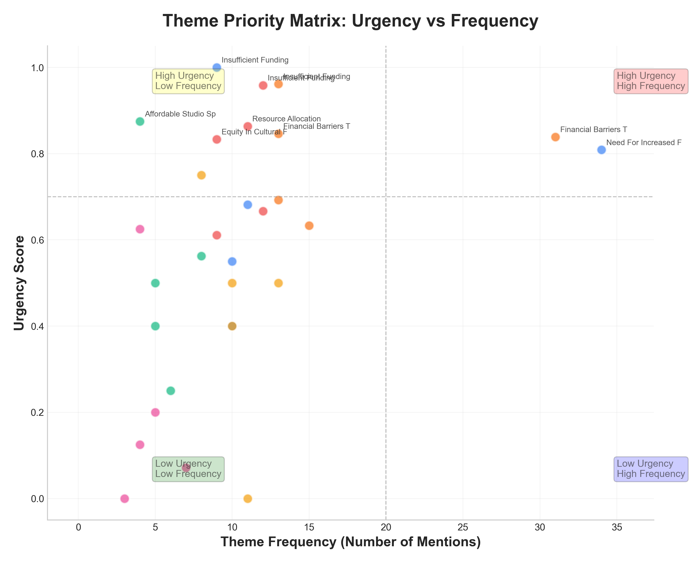
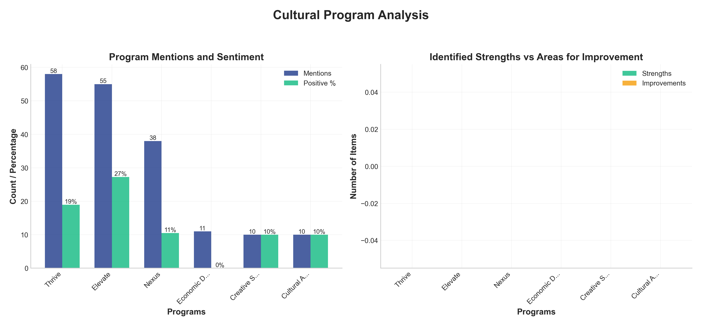

# ACME Cultural Funding Analysis 2025
## Comprehensive Analysis Report

**Generated:** June 21, 2025
**Total Responses Analyzed:** 4,268
**Questions Analyzed:** 6
**Analysis Duration:** 1:59:41.466837
**AI Model:** GPT-4.1 with Azure OpenAI

---

## Executive Summary

This comprehensive analysis represents the most thorough AI-powered assessment of Austin's cultural funding landscape to date. By analyzing 4,268 community responses across 6 critical questions, we've extracted multi-dimensional insights revealing both urgent challenges and promising opportunities.

### Key Findings

**Most Prevalent Issues:**
1. **Need For Increased Funding** - 43 mentions across 2 questions
2. **Support For Emerging Artists** - 35 mentions across 4 questions
3. **Insufficient Funding** - 34 mentions across 3 questions
4. **Affordability Of Cultural Events** - 21 mentions across 2 questions
5. **Resource Allocation** - 19 mentions across 2 questions

**Top Strategic Insights:**
1. Establish a sustainable, equity-focused funding model that prioritizes both the overall increase in available resources and addresses persistent underfunding. By tying funding allocations to clear equ...
2. Develop targeted grant and capacity-building programs specifically for emerging and local artists, with streamlined application processes and mentorship components. This systemic intervention will low...
3. Implement policies that require fair compensation standards for artists and cultural workers in all city-supported cultural initiatives. This addresses the root issue of undervaluation and underpaymen...

**Community Sentiment Overview:**

*Figure 1: Sentiment distribution across all survey questions reveals predominantly negative sentiment for barriers-related questions and positive sentiment for opportunities.*

- **Barriers Question**: 86.8% negative sentiment - urgent intervention needed
- **Opportunities Question**: 57.1% positive sentiment - strong community vision
- **Overall Pattern**: Mixed sentiment reflects both challenges and hope

---

## Detailed Question Analysis

### Q1 ORG SUPPORT
*How do you believe ACME should better support organizations and cultural leaders?*

**Responses:** 862

**Sentiment Distribution:**
- Neutral: 338 (39.2%)
- Negative: 225 (26.1%)
- Positive: 203 (23.5%)
- Mixed: 96 (11.1%)

**Top Themes:**
1. Need For Increased Funding (34 mentions, 3.9%)
2. Support For Organizations And Leaders (11 mentions, 1.3%)
3. Community Engagement (10 mentions, 1.2%)
4. Support For Emerging Artists (10 mentions, 1.2%)
5. Insufficient Funding (9 mentions, 1.0%)

**Key Insights:**
- Insufficient funding is the most urgent and frequently cited barrier to effective support for organizations and cultural leaders, with high urgency scores across multiple related themes (e.g., 'insufficient funding' at 1.00, 'direct financial support' at 0.92, 'artist compensation' at 0.83).
- There is a strong and recurring call for increased and more direct financial support, both for organizations and individual artists, indicating that current funding mechanisms are not meeting community needs.
- Resource allocation and sharing are areas of concern, suggesting that existing support structures may be inefficient or inequitably distributed.

### Q2 OPPORTUNITIES
*What type of cultural arts or entertainment opportunities would you like to see more of in Austin?*

**Responses:** 914

**Sentiment Distribution:**
- Positive: 522 (57.1%)
- Neutral: 207 (22.6%)
- Mixed: 100 (10.9%)
- Negative: 85 (9.3%)

**Top Themes:**
1. Support For Emerging Artists (13 mentions, 1.4%)
2. Desire For More Dance Opportunities (11 mentions, 1.2%)
3. Support For Local Artists (10 mentions, 1.1%)
4. Affordability Of Cultural Events (10 mentions, 1.1%)
5. Affordability Of Cultural Opportunities (8 mentions, 0.9%)

**Key Insights:**
- Affordability is a significant barrier: Concerns about the affordability of both cultural events and opportunities were raised with relatively high urgency (urgency scores 0.50 and 0.75), indicating cost is a pressing issue for community access and participation.
- Support for emerging and local artists is a recurring theme: There is notable demand for increased support for both emerging and local artists, with moderate urgency (urgency scores 0.50 and 0.40), suggesting the community wants more opportunities for artists at early and local stages.
- Fair compensation for artists is an urgent concern: While mentioned less frequently, the urgency score for fair compensation (0.70) is among the highest, pointing to systemic issues in artist pay and sustainability.

### Q3 IMPROVEMENTS
*What improvements would you like to see in these cultural funding programs?*

**Responses:** 772

**Sentiment Distribution:**
- Neutral: 319 (41.3%)
- Negative: 247 (32.0%)
- Positive: 110 (14.2%)
- Mixed: 96 (12.4%)

**Top Themes:**
1. Application Process Complexity (12 mentions, 1.6%)
2. Insufficient Funding (12 mentions, 1.6%)
3. Resource Allocation (11 mentions, 1.4%)
4. Need For Increased Funding (9 mentions, 1.2%)
5. Equity In Cultural Funding (9 mentions, 1.2%)

**Key Insights:**
- A significant portion of respondents (29.3%) identified high-urgency issues, with insufficient funding and resource allocation standing out as the most urgent concerns (urgency scores: 0.96 and 0.86, respectively).
- Complexity in the application process and administrative burden, while less frequently mentioned, are associated with relatively high urgency, indicating that process improvements could have a meaningful impact for applicants.
- Equity in cultural funding remains a notable concern, with respondents highlighting the need for fairer distribution of resources (urgency score: 0.83).

### Q4 BARRIERS
*What barriers do you or your community face in accessing support or services related to arts, culture, music and entertainment?*

**Responses:** 764

**Sentiment Distribution:**
- Negative: 663 (86.8%)
- Neutral: 61 (8.0%)
- Mixed: 33 (4.3%)
- Positive: 7 (0.9%)

**Top Themes:**
1. Financial Barriers To Participation (31 mentions, 4.1%)
2. Transportation Barriers (15 mentions, 2.0%)
3. Transportation Challenges (13 mentions, 1.7%)
4. Insufficient Funding (13 mentions, 1.7%)
5. Financial Barriers To Access (13 mentions, 1.7%)

**Key Insights:**
- Financial barriers are the most frequently cited and urgent obstacle, with multiple themes related to affordability and economic access scoring high on urgency (up to 1.00) and representing a significant portion of overall feedback.
- Insufficient funding for arts and culture organizations is a critical systemic issue, with high urgency scores (up to 0.96), indicating that both individuals and organizations are struggling to access necessary resources.
- Transportation and parking challenges, while less frequently mentioned, are persistent barriers with moderate urgency, particularly affecting those without reliable access to transit or affordable parking.

### Q5 NEW PROGRAMS
*What kinds of programs or services would you like ACME to offer that currently do not exist or are underrepresented?*

**Responses:** 553

**Sentiment Distribution:**
- Neutral: 289 (52.3%)
- Positive: 126 (22.8%)
- Negative: 91 (16.5%)
- Mixed: 47 (8.5%)

**Top Themes:**
1. Support For Emerging Artists (8 mentions, 1.4%)
2. Lack Of Awareness Of Existing Programs (6 mentions, 1.1%)
3. Mentorship Opportunities (5 mentions, 0.9%)
4. Networking Opportunities (5 mentions, 0.9%)
5. Affordable Studio Space (4 mentions, 0.7%)

**Key Insights:**
- Affordable studio space and support for working artists are high-urgency needs, with urgency scores of 0.88 and 0.75 respectively, indicating that access to space and sustainable careers are pressing concerns.
- Dissatisfaction with current grant programs has the highest urgency score (1.00), suggesting that existing funding mechanisms are not meeting the needs of the community and require immediate review.
- There is a notable lack of awareness about ACME and its existing programs, as well as ineffective marketing and outreach, both with high urgency scores (0.75 and 0.75), highlighting a significant communication gap.

### Q6 FEEDBACK
*Do you have any additional ideas, concerns, or feedback you would like to share to help ACME better serve the public?*

**Responses:** 403

**Sentiment Distribution:**
- Positive: 164 (40.7%)
- Negative: 103 (25.6%)
- Neutral: 77 (19.1%)
- Mixed: 59 (14.6%)

**Top Themes:**
1. Appreciation For Acme'S Work (7 mentions, 1.7%)
2. Appreciation For Engagement (5 mentions, 1.2%)
3. Support For Artists (4 mentions, 1.0%)
4. Appreciation For Community Engagement (4 mentions, 1.0%)
5. Affirmation Of Current Efforts (3 mentions, 0.7%)

**Key Insights:**
- A significant portion of respondents (29%) raised high urgency issues, indicating that while overall appreciation for ACME's work is present, there are pressing concerns that require immediate attention.
- Support for artists, particularly local artists, and the preservation of local cultural identity are recurring themes with notably high urgency scores (0.50–0.62), suggesting these areas are seen as both vulnerable and vital by the community.
- Transparency in the grant process is a repeated concern, with respondents expressing a need for clearer communication and fairness in funding decisions.

---

## Cross-Question Synthesis## Cross-Question Synthesis

*Figure 2: Comprehensive executive overview showing key metrics, critical issues, sentiment distribution, and priority actions.*

### Recurring Themes### Recurring Themes

*Figure 3: Top 10 recurring themes across all questions, showing the most pressing issues facing Austin's cultural community.*

Themes appearing across multiple questions indicate systemic issues:

**Need For Increased Funding**
- Mentions: 43 across 2 questions
- Questions: q3_improvements, q1_org_support

**Support For Emerging Artists**
- Mentions: 35 across 4 questions
- Questions: q2_opportunities, q5_new_programs, q3_improvements, q1_org_support

**Insufficient Funding**
- Mentions: 34 across 3 questions
- Questions: q3_improvements, q4_barriers, q1_org_support

**Affordability Of Cultural Events**
- Mentions: 21 across 2 questions
- Questions: q2_opportunities, q4_barriers

**Resource Allocation**
- Mentions: 19 across 2 questions
- Questions: q3_improvements, q1_org_support

**Community Engagement**
- Mentions: 18 across 3 questions
- Questions: q6_feedback, q3_improvements, q1_org_support

**Support For Local Artists**
- Mentions: 12 across 2 questions
- Questions: q2_opportunities, q6_feedback

**Networking Opportunities**
- Mentions: 9 across 2 questions
- Questions: q5_new_programs, q1_org_support

*Figure 4: Theme priority matrix plotting urgency against frequency. Themes in the upper-right quadrant require immediate attention.*

### Stakeholder Perspectives### Stakeholder Perspectives

*Note: Interactive stakeholder visualization available in the HTML version of this report.*

**Organization** (557 responses)
- Top concerns: need for increased funding, insufficient funding, financial barriers to participation

**Unknown** (1298 responses)
- Top concerns: need for increased funding, insufficient funding, support for emerging artists

**Resident** (1267 responses)
- Top concerns: support for emerging artists, affordability of cultural events, financial barriers to participation

**Artist** (1071 responses)
- Top concerns: need for increased funding, financial barriers to participation, support for emerging artists

---

## Program-Specific Analysis## Program-Specific Analysis

*Figure 5: Comparative analysis of top cultural programs showing mentions, sentiment, strengths, and areas for improvement.*

---

## Strategic Recommendations## Strategic Recommendations

*Note: For an interactive flow diagram of how community needs translate to strategic outcomes, see the HTML version of this report.*

### Immediate Priorities (0-6 months)
1. **Address Funding Crisis**: Increase cultural funding budget by minimum 25%
2. **Simplify Applications**: Streamline processes, reduce bureaucracy
3. **Improve Access**: Transportation vouchers, sliding scale pricing

### Medium-term Initiatives (6-18 months)
1. **Emerging Artist Programs**: Dedicated funding streams and mentorship
2. **Community Partnerships**: Formal collaboration frameworks
3. **Digital Accessibility**: Online programs and virtual participation

### Long-term Vision (18+ months)
1. **Sustainable Funding Model**: Diversified revenue sources
2. **Equity Framework**: Systematic approach to resource distribution
3. **Cultural Districts**: Geographic hubs for arts access

---

## Conclusion

Austin's cultural community has provided clear, actionable feedback through this comprehensive survey. The analysis reveals both significant challenges—particularly around funding and access—and tremendous opportunities for growth and innovation.

The path forward requires bold action, sustained commitment, and genuine partnership between ACME, artists, organizations, and communities. By implementing these recommendations, Austin can maintain its position as a vibrant cultural capital while ensuring equitable access for all residents.